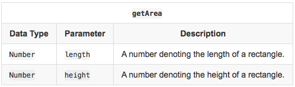
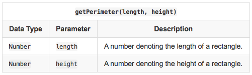

# 😱😱Day 42 of 100 Days of Code

## JavaScript 

Well today I studied functions in JavaScript and did a lil bit of tasks.

I did understand the method of creating functions using different ways and the different types of functions.

- Declaration 
- Expression 
- Arrow
- Anonymous functions 

Did not complete the tasks but I am hoping to have them done tomorrow as I continue with another day of code challenge in JS, PY, Java or C++ with ALX.

The tasks I did were as follows;

## Task 1

**Objective**

In this challenge, we practice using arithmetic operators. Check out the attached tutorial for resources.

Complete the following functions in the editor below:
- getArea(length, width): Calculate and return the area of a rectangle having sides length and width.
- getPerimeter(length, width): Calculate and return the perimeter of a rectangle having sides length and width.
The values returned by these functions are printed to stdout by locked stub code in the editor.

**Input Format**





**Constraints**
- 1 <= length, width <= 1000
- length and width are scaled to at most three decimal places

**Output Format**


## Task 2

**Objective**

Today, we're discussing JavaScript functions. Check out the attached tutorial for more details.

Implement a function named factorial that has one parameter: an integer, n. It must return the value of n! (i.e., n factorial).

**Input Format**

Locked stub code in the editor reads a single integer, , from stdin and passes it to a function named factorial.

**Constraints**

- 1 <= n <= 10 

**Output Format**

The function must return the value of n.

Sample Input 0
```sh
4
```
Sample Output 0
```sh
24
```


## Task 3

**Objective**

In this challenge, we practice declaring variables using the let and const keywords. Check out the attached tutorial for more details.

- Declare a constant variable, PI, and assign it the value Math.PI. You will not pass this challenge unless the variable is declared as a constant and named PI (uppercase).
- Read a number, r, denoting the radius of a circle from stdin.
- Use PI and r to calculate the area and perimeter of a circle having radius r.
- Print area as the first line of output and print perimeter as the second line of output.


**Done**

The codes to this tasks will be uploaded with different repo since it is part of another Journey in Coding.


## ALX 

I did python more data structures 

The tasks were challenging as I had forgotten some of the concepts in Python but I managed to conquer them all.