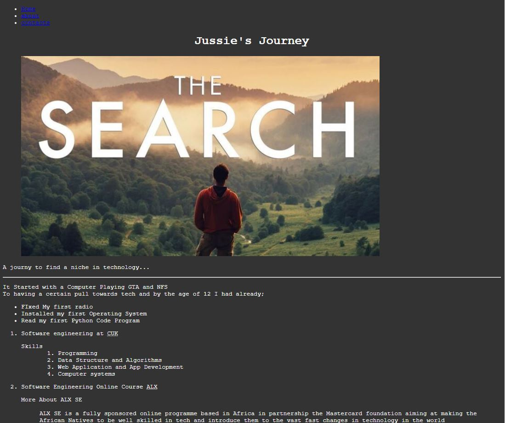
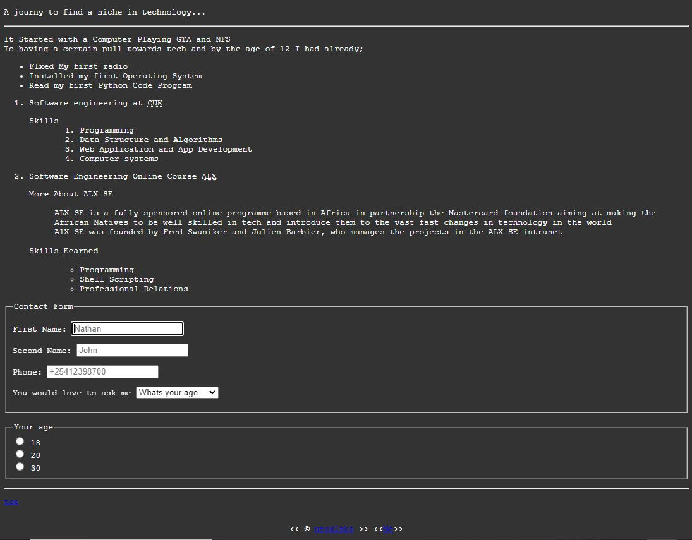

# ✔✨Day 45 of 100 Days of Code

## HTML

Started a HTML course Earlier last week and did a couple of tests and runs. 
Learnt about the different tags in HTML and their use.

HTML comprises of many tags hard to list them all but got a chance of learning more about the semantic tags. Tags that are used to define the meaning of the content they contain.
These are;
- header
- article
- footer
- main

These tags help one know the content and its role.

The topics I covered in summary were;
- Tags
- Links
- Images
- Forms 
- Tables

The result of the short tutorial on the above had me generate a sample website pretty basic

The day was fully dedicated to HTML cause of work I did not have much time to complete the page. Hoping on learning more and more and make the page more appealing to the eye using CSS and JS after learning each.

## ALX SE 

A couple of tasks on Dynamic Libraries to end my day.

It was pretty hard since I did in a tired mind but phased through  it all 

## C'est Tout 

### 🎖Happy Coding
