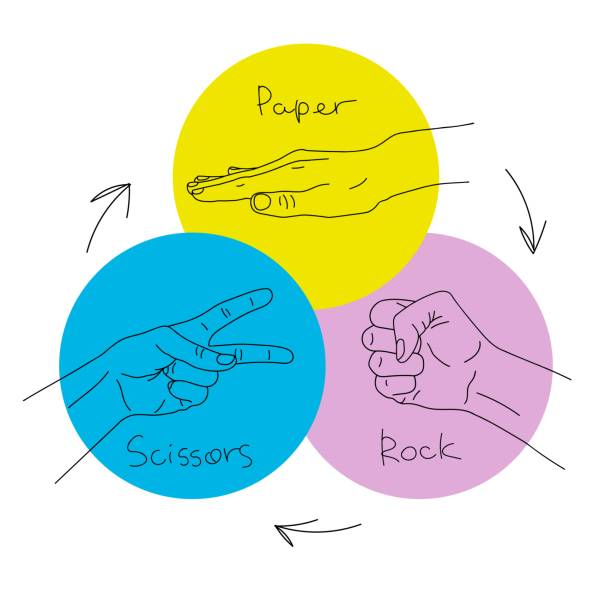

# Day 47 of 100 Days of Code

I continued with a personal project that I was working on for my first web portfolio. It was Kinda tough since I had not finalized learning about css and with the current progress am making in progress so most of the codes were googled and aided by with some of the online tutorials found in youtube.

After trying a few of my codes I did the following projects in Python after the previous tutorials with Jenny's Lectures.

## 1. Rock Paper Scissors

The game is pretty much simple for everyone since has been played by almost every person in this world, estimates.

The rules of the game are quite simple:
- Rock beats scissors
- Scissors beats paper
- Paper beats rock

The game runs through ten where the winner gets a value greater than ten or ten.

It is automated such that the computer's choice is a set of random options to make the game a little bit competitive

The [code](./rock.py) is here.

Have fun

## 2. Ceaser Cipher

As Known this is a encryption and decryption algorithm that changes a message to a cipher that can be later decrypted to reveal its current contents.

The [code](./ceaser.py) structure is simple.

## In Other News

The day ended with a bit of a studt session on an ALX task hoping that I will understand the concepts and finally do the tasks.

## Happy Coding