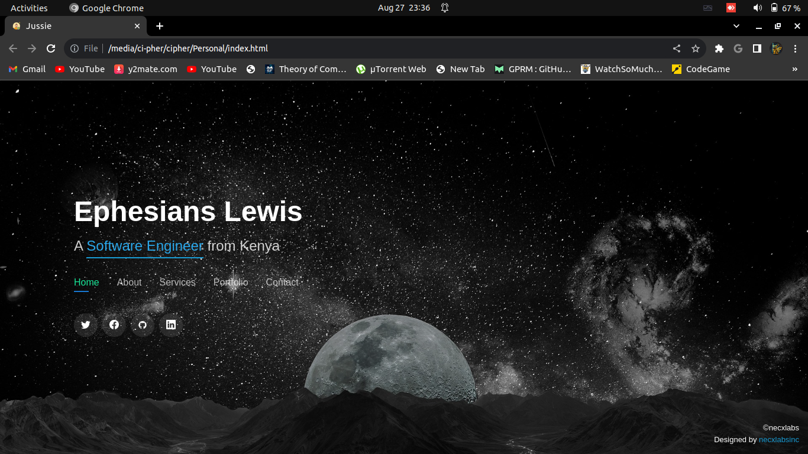
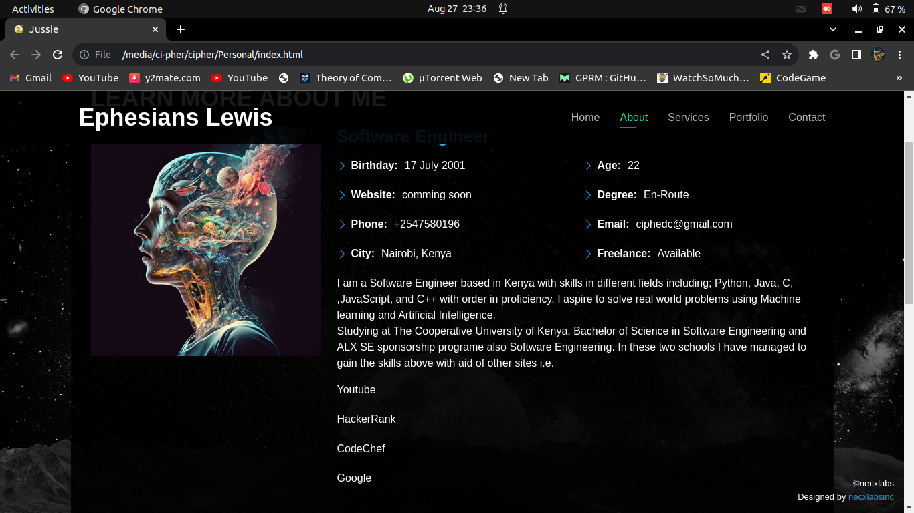
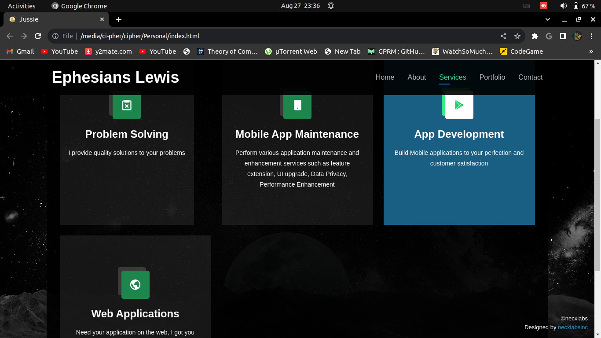
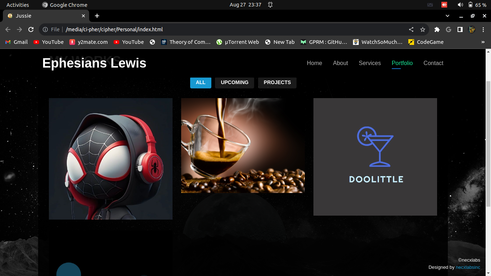
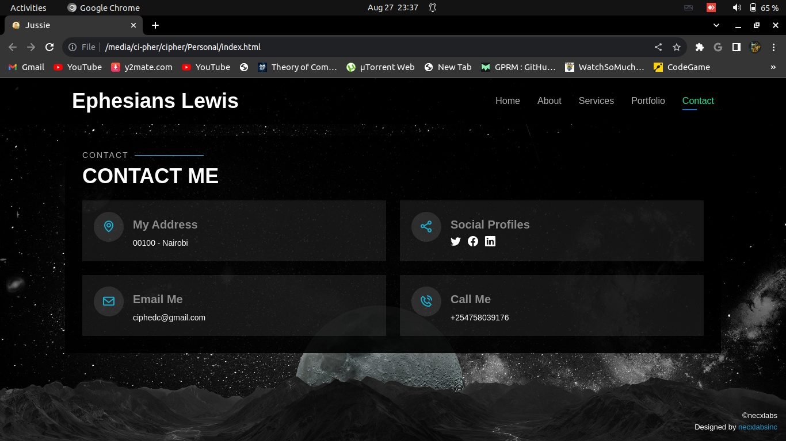

# Day 49 of 100 Days of Code

# PoRt-FOlIO

Well continued with my landing page a one page website where I tell more about myself, what I do and all that I am interested and how to reach me. The site is barely done or hosted so it can't be accessed by anyone untill I host it. It is one of my final year and challenge projects alongside others that are yet to come.

The snapshots to the codes site are;

## Front Page

## About Section

## Services Section

## Works Section

## Contact Section

++++++++++++++

The project is part of my journy in learning PHP for mailing, HTML and CSS for the front end, and JS for DOM and Backend.

Hoping to grasp each and every concept through these short programms that I write.

### Happy Coding